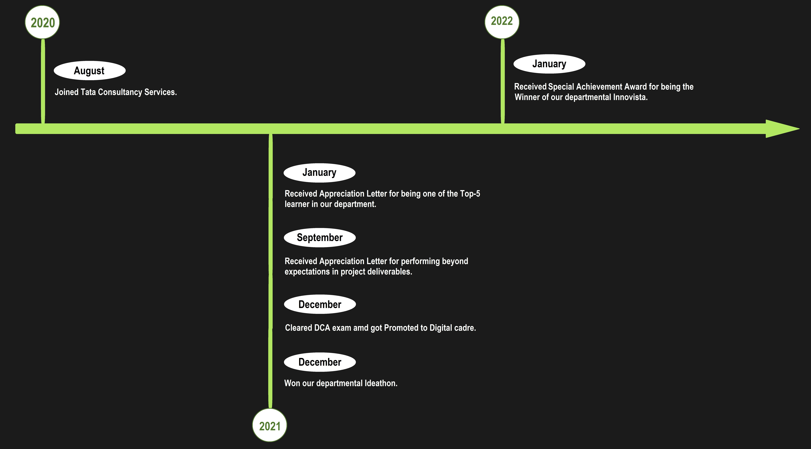
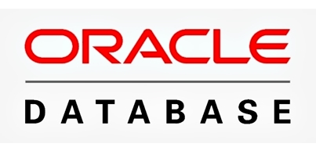
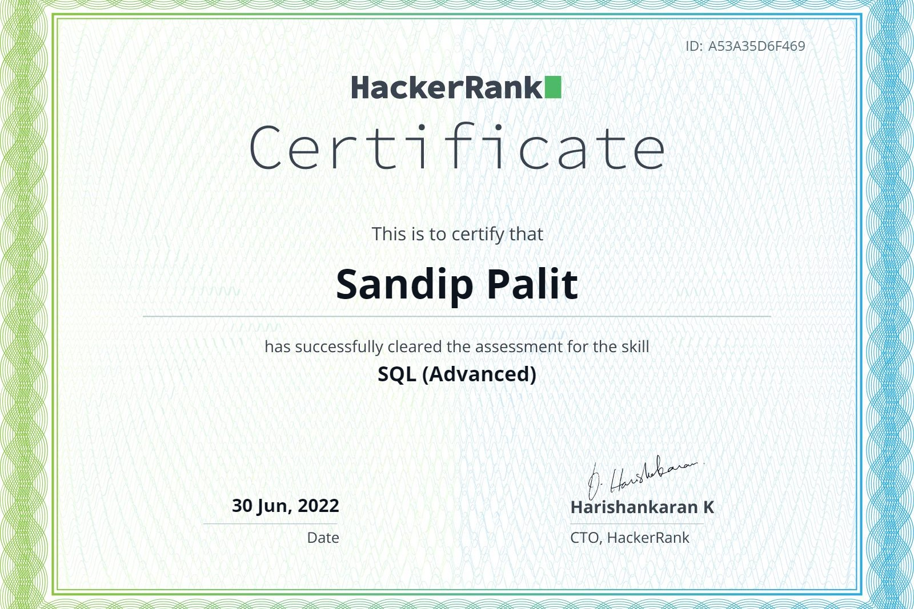
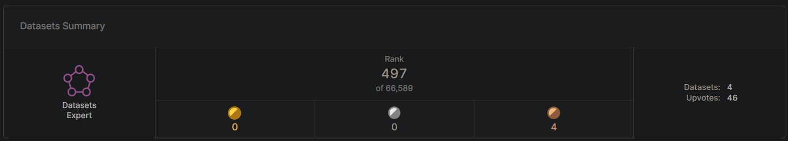

[< About Me >](#SandipPalit) &nbsp; &nbsp;
[< Projects >](#Projects) &nbsp; &nbsp;
[< Dev Profiles >](#DevProfiles)

 
<h1 align="center"><b> Sandip Palit </b></h1>
<h3 align="center"> Data Engineer </h3>
<h6 align="center"> I am a Data Engineer with 2+ years of experience in the Data Science domain. My technical skills primarily include SQL, Python, Microsoft Azure, Power BI & Denodo. I am 8 times Microsoft Certified, including Azure Data Engineer Associate. I am also a Kaggle Dataset Expert with highest global ranking < 500. </h6>

 

###  _Journey so far_

<h6 align="center"><i> My Professional Journey so far. </i></h6>

 

###  _Tech Skills_

<table>
  <tr>
    <td width="12.5%"></td>
    <td width="12.5%"></td>
    <td width="12.5%"></td>
    <td width="12.5%"></td>
    <td width="12.5%"></td>
    <td width="12.5%"></td>
    <td width="12.5%"></td>
  </tr>
</table>

 

###  _Certifications_

<table>
  <tr>
    <td width="25%">
      
      <h6 align="center"><i> Microsoft Certified: Azure Data Engineer Associate </i></h6>
    </td>
    <td width="25%">
      
      <h6 align="center"><i> Microsoft Certified: Power BI Data Analyst Associate </i></h6>
    </td>
    <td width="25%">
      
      <h6 align="center"><i> Microsoft Certified: Azure AI Engineer Associate </i></h6>
    </td>
    <td width="25%">
      
      <h6 align="center"><i> Microsoft Certified: Azure Data Fundamentals </i></h6>
    </td>
  </tr>
  <tr>
    <td width="25%">
      
      <h6 align="center"><i> Microsoft Certified: Power Platform Fundamentals </i></h6>
    </td>
    <td width="25%">
      
      <h6 align="center"><i> Microsoft Certified: Azure AI Fundamentals </i></h6>
    </td>
    <td width="25%">
      
      <h6 align="center"><i> Microsoft Certified: Azure Fundamentals </i></h6>
    </td>
    <td width="25%">
      
      <h6 align="center"><i> HackerRank Certified: SQL (Advanced) </i></h6>
    </td>
  </tr>
</table>

 

###  _Research Article_

<table width="100%">
  <tr>
    <td width="43%">
      
      <h6 align="center"><i> Research article on 'Real Time Sentiment Analysis' published in 'International Journal of Synthetic Emotions'. </i></h6>
    </td>
    <td width="57%">
      
      <h6 align="center"><i> It has been featured in the IGI Global Research Anthology titled 'Research Anthology on Implementing Sentiment Analysis Across Multiple Disciplines'. </i></h6>
    </td>
  </tr>
</table>

 

###  _Python Package_

<table width="100%" >
  <tr>
    <td width="68%">
      
      <h6 align="center"><i> Relocate is a Python library which helps us in organizing our files into distinct folders. </i></h6>
    </td>
    <td width="32%">
      
      <h6 align="center"><i> Currently, it has 5000+ downloads. </i></h6>
    </td>
  </tr>
</table>

 

###  _Connect with me_

&nbsp; &nbsp;

 

---

 
<h2 align="center"> Projects </h2>
 

<table width="100%" >
  <tr>
    <td width="50%">
      
       
      <h3> Temperature Data Scraping </h3>
      <h6>Python, Extract Load Transform, Web Scraping, Database.</h6>
       
      <h5 style="color: white !important;">Being a Traveller by heart, I know how weather or temperature plays an important role in our planning.
      So I wanted to discover how the temperature varies over the various months, in Indian travel destinations.</h5>
       
      <h5 style="color: white !important;">I extracted the raw data from the internet through Web Scraping and loaded the data into a database.
      Then I transformed the data and visualized it using Matplotlib.</h5>
       
      <h4 align="center">Explore the <a href="https://github.com/SandipPalit/Data-Engineering/tree/main/Temperature%20Data%20Scraping">Codebase</a>.</h4>   
    </td>
    <td width="50%">
      
       
      <h3> Movie-Recommender </h3>
      <h6>Python, Natural Language Processing, Cosine Similarity.</h6>
       
      <h5 style="color: white !important;">How do the OTT platforms recommend the web series and do they know my preference?
        While finding the answer,  I became curious about Natural Language Processing and developed this Recommendation engine.</h5>
       
      <h5 style="color: white !important;">After performing pre-processing and feature engineering, I used Cosine Similarity to find the similarity score between the movies. 
      Then for each movie, I ranked the other movies to get the recommendations.</h5>
       
      <h4 align="center">Experience it <a href="https://movierecommender-sandippalit.herokuapp.com/">Live</a>.</h4>
    </td>
  </tr>
</table>

---

 
<h2 align="center"> Dev Profiles </h2>
 

### _Github Profile_

<table >
  <tr width="100%">
    <td>
      
    </td>
    <td>
      
    </td>
  </tr>
</table>
  
 

### _Kaggle Profile_

<table >
  <tr>
    <td>
      
    </td>
  </tr>
</table>

 
